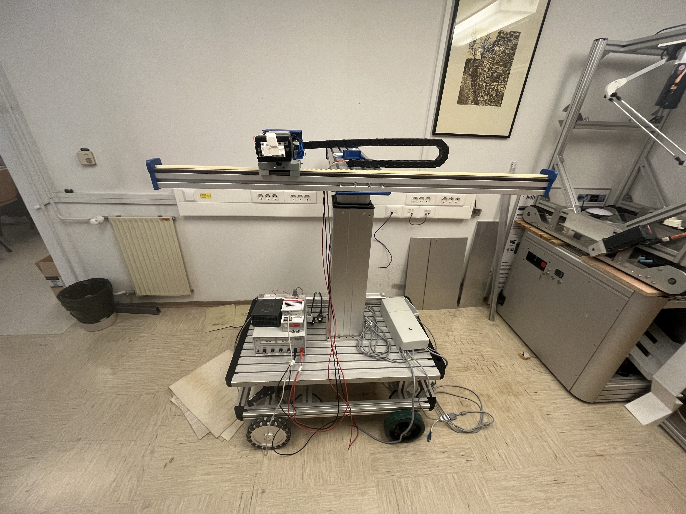
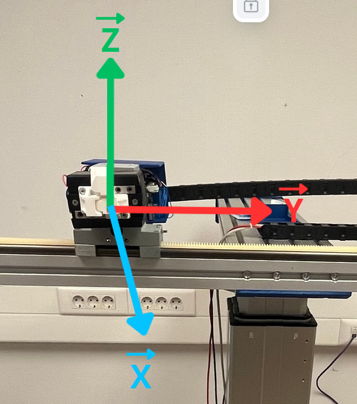
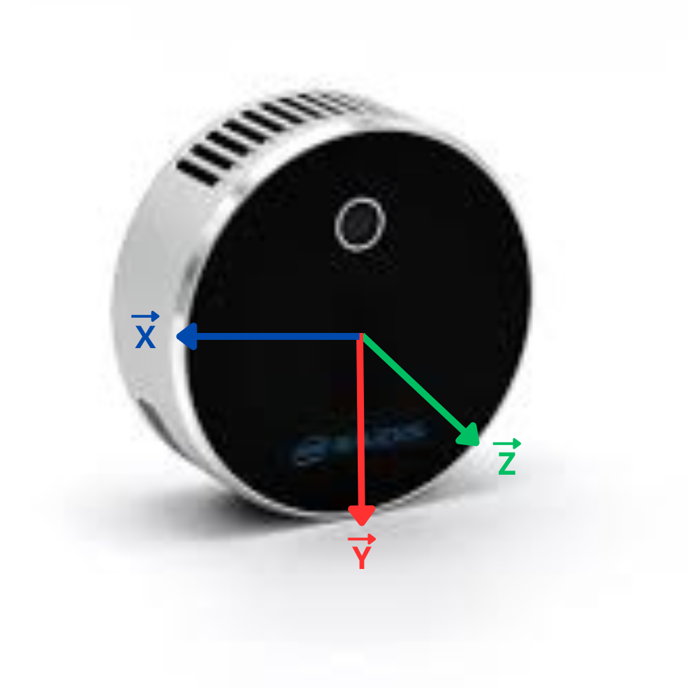
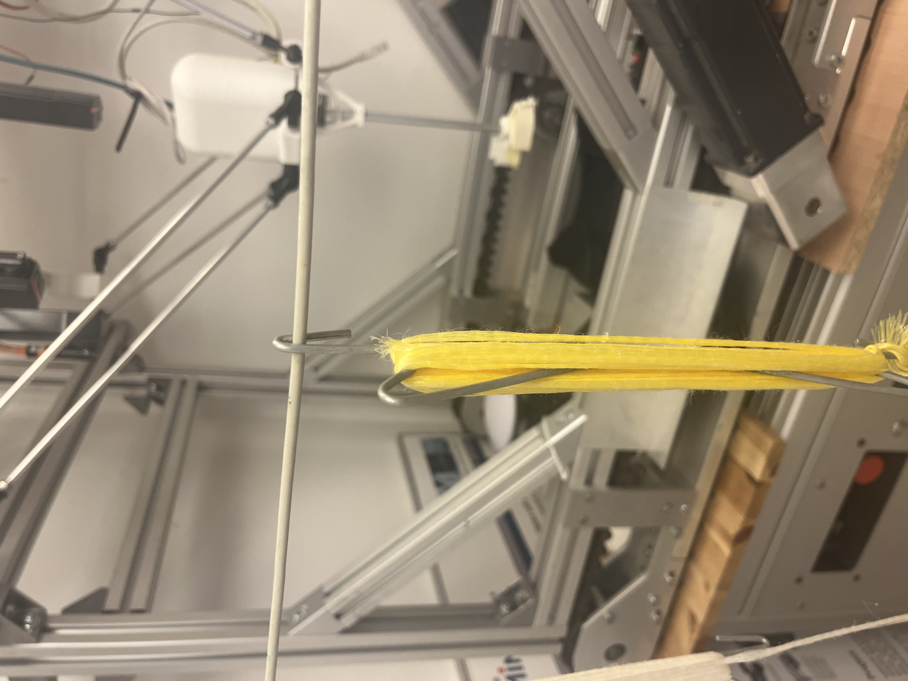

# TOMATO ROBOT (TOBOT)

[](https://forthebadge.com) [](https://forthebadge.com)

## Presentation 

This robot is built to work in above-ground tomato fields. It is designed to pass between rows of tomatoes to perform various manipulations. This repository contains all the ROS2 programs for controlling the Cartesian manipulator. This project was completed during my internship at the RoboLab of the Faculty of Electrical Engineering, University of Ljubljana.



## Table of Contents
- [Project Title](#tomato-robot-tobot)
- [Presentation](#presentation)
- [Table of Contents](#table-of-contents)
- [Installation](#installation)
  - [ROS Installation](#ros-installation)
  - [RealSense SDK](#realsense-sdk)
  - [Python Libraries](#python-libraries)
  - [Project Installation](#project-installation)
- [ROS Packages Description](#ros-packages-description)
  - [Beckhoff](#beckhoff)
  - [Platform Lift](#platform-lift)
  - [Camera](#camera)
  - [Command](#command)

## Installation 

### ROS Installation 

This project uses ROS2 Humble. To install, follow the steps [here](https://docs.ros.org/en/humble/Installation.html).

### RealSense SDK

The RealSense L515 camera is an EOL product, so you need to install SDK version 2.54.2. While it's not essential to install this SDK, if you choose to, follow these steps:

#### Prerequisites

Ensure your system is up to date:

```bash
sudo apt update
sudo apt upgrade -y
```

#### Step 1: Install Necessary Dependencies

Install the required dependencies for the RealSense SDK:

```bash
sudo apt-get install git libssl-dev libusb-1.0-0-dev pkg-config libgtk-3-dev -y
sudo apt-get install libglfw3-dev libgl1-mesa-dev libglu1-mesa-dev -y
```

#### Step 2: Clone the librealsense Repository

Clone the `librealsense` repository from GitHub:

```bash
git clone https://github.com/IntelRealSense/librealsense.git
cd librealsense
git checkout v2.54.2
```

#### Step 3: Build and Install the SDK

Create a build directory and compile the SDK:

```bash
mkdir build && cd build
cmake ../ -DBUILD_EXAMPLES=true -DCMAKE_BUILD_TYPE=Release
make -j4
sudo make install
```

#### Step 4: Configure udev Rules

To allow all users to access RealSense devices, install the `udev` rules:

```bash
sudo cp config/99-realsense-libusb.rules /etc/udev/rules.d/
sudo udevadm control --reload-rules && udevadm trigger
```

#### Step 5: Verify the Installation

You can verify that the SDK is correctly installed by running an example provided with the SDK:

```bash
realsense-viewer
```

### Python Libraries 

| Library   | Pip Installation Command  | Current Version |
| ------------- |:-------------:|------------- |
| numpy     | ```pip install "numpy >= 1.17.3, <1.25.0"```   | 1.24.0 |
| openCV      | ```pip install opencv-python```    |  |
| open3D     | ```pip install open3d```    |  |
| matplotlib     | ```pip install matplotlib```    |  |
| realsense viewer     | ```pip install pyrealsense2==2.54.2```    | 2.54.2 |
| scipy | ```pip install scipy``` | 1.8.0 |
| pyADS | ```pip install pyads``` |  |

### Project Installation

To get started with the TOBOT project, follow these steps to install and set up the necessary project files and dependencies:

#### Step 1: Clone the Repository

First, you need to clone the project repository from GitHub. This will download all the necessary files to your local machine.

```bash
git clone https://github.com/lorianem/RosSystem.git
```

#### Step 2: Navigate to the Project Directory

After cloning the repository, navigate to the project directory.

```bash
cd RosSystem
```

#### Step 3: Build the Project & Source the Environment

Build the project using `colcon` to compile all the packages and dependencies.

```bash
colcon build
```

After building the project, source the environment to overlay this workspace on top of your current ROS2 installation.

```bash
source install/local_setup.bash
```

#### Step 4: Run the Project

Now you can run the various nodes and services defined in the project. For example, to start a particular node:

```bash
ros2 run <package_name> <node_name>
```

Replace `<package_name>` with the actual package name and `<node_name>` with the specific node you want to run.

## ROS Packages Description  

### Beckhoff 

This package manages the communication with the Beckhoff module, to move the different axes, the rotation of the head, and the gripper. This communication is done with PyADS to communicate via PLC to Beckhoff. 

#### Interfaces

- [TargetPose.srv](#target-pose-service)
- [CartesianMove.srv](#cartesian-move-service)
- [HeadRotation.srv](#head-service)
- [Gripper.srv](#gripper-service)
- [Position.msg](#position-message)
  
##### Target Pose Service 

Request:

|  Name   | Type | Description |
| ------------- |:-------------:|------------- |
| dx | float64    | displacement of the robot along X (mm) |
| dy | float64    | displacement of the robot along Y (mm) |
| dz | float64    | displacement of the robot along Z (mm) |
| vel | float64    | desired max velocity (mm/s) |
| mode | string   | movement type: `r` = relative, `a` = absolute |

Response:

|  Name   | Type | Description |
| ------------- |:-------------:|------------- |
| feedback | string  | |

##### Cartesian Move Service 

Request:

|  Name   | Type | Description |
| ------------- |:-------------:|------------- |
| x | float64    | final X position (mm) |
| y | float64    | final Y position (mm) |
| z | float64    | final Z position (mm) |
| vel_x | float64    | velocity of the x-axis (mm/s) |
| vel_y | float64    | velocity of the y-axis (mm/s) |
| vel_z | float64    | velocity of the z-axis (mm/s) |
| acc_x | float64    | acceleration of the x-axis (mm/s²) |
| acc_y | float64    | acceleration of the y-axis (mm/s²) |
| acc_z | float64    | acceleration of the z-axis (mm/s²) |

Response:

|  Name   | Type | Description |
| ------------- |:-------------:|------------- |
| feedback | string  | |

##### Head Service 

Request:

|  Name   | Type | Description |
| ------------- |:-------------:|------------- |
| deg | float64    | degrees of rotation of the head (°) |
| vel | float64    | desired max velocity (°/s) |

Response:

|  Name   | Type | Description |
| ------------- |:-------------:|------------- |
| feedback | string  | |

##### Gripper Service 

Request:

|  Name   | Type | Description |
| ------------- |:-------------:|------------- |
| status | boolean  | status of the gripper, `false` = open, `true` = close |

Response:

|  Name   | Type | Description |
| ------------- |:-------------:|------------- |
| feedback | string  | |

##### Position Message 

|  Name   | Type | Description |
| ------------- |:-------------:|------------- |
| x | float64    | actual X position (mm) |
| y | float64    | actual Y position (mm) |
| r | float64    | actual R position (mm) |

#### Nodes 

##### Communication 

Coordinate system:



This package connects to these interfaces:
  - [Cartesian Move Service](#cartesian-move-service)
  - [Head Service](#head-service)
  - [Gripper Service](#gripper-service)
  - [Position Message](#position-message)

The communication node sends all the values at once via an array to Beckhoff. To communicate via PyADS from an external PC, you need to add a new Route on TwinCAT. Follow the steps [here](https://github.com/stlehmann/pyads/issues/281#issuecomment-956370290).

### Platform Lift 

This package manages the control of the TLT10-CX axis connected to an SCU (Servo Control Unit) via USB, using serial communication. The lift allows for vertical movement to adjust the height of the robot's platform.

#### Interfaces

##### Position Lift Message

Request: 
``` none ```

Response: 

|  Name   | Type | Description |
| ------------- |:-------------:|------------- |
| x | float64    | actual X position (mm) |

##### Move Lift Action 

Request:

|  Name   | Type | Description |
| ------------- |:-------------:|------------- |
| goal_position | uint16  | z goal position |

Response:

|  Name   | Type | Description |
| ------------- |:-------------:|------------- |
| success | bool  | |

Feedback:

|  Name   | Type | Description |
| ------------- |:-------------:|------------- |
| current_position | uint16  | current position z |

#### Nodes

##### Lift Communication

The `lift_communication.py` node of the package allows communication with the SCU control unit through the RS232 serial interface that manages the lift actuators. It implements a `/moveLift` action server that moves the lift to the desired position and sends a success message when reaching the final position. It also implements a `/posLift` service that returns the position of the lift.

To use this node, add the following line to your launch file:

```xml
<node pkg="platform_lift" type="lift_communication.py" name="lift_communication"/>
```

You may need to change the port for serial communication, which is currently set to `/dev/ttyUSB0` in the `init_serial()` function of `serial_interface.py`.

This package connects to these interfaces:
 - [Position Lift Message](#position-lift-message)
 - [Move Lift Action](#move-lift-action)

### Camera 

This node is used to automatically control the robot with a RealSense L515 camera(s) connected via USB 3.1 or higher. 

 

##### Camera 

This works with functions defined in the file `camera_function.py`. The robot uses this node to detect and manipulate tomato hooks based on depth data.

Steps:
1. `RS_burstMulti` determines the centers of each hook using a histogram of the positions of all points from the depth camera.
2. `getNextPeak` provides the relative position of the next peak, based on the positions determined in step 1.
3. The robot moves closer to the hooks and uses `RS_burst_find_closest` to find the closest point in front of it. Be careful, the robot may not detect the hook if it is too close.
4. Manipulate the hooks and go back to step 2.

This package connects to these interfaces:
- [Target Pose Service](#target-pose-service)

### Command 

This package is used for testing and visualization, allowing you to see all the interfaces and independently command everything. For each command, the argument is the values of the request of each interface.

- **Command Axis** : Move the axis via the target pose service 
- **Command Lift** : Move lift axis via lift action
- **Command Head** : Rotate the head via head rotation service
- **Command Gripper**: Close/Open the gripper via gripper service
- **getPosLift** : Service to get the current position of the Z axis 
- **listenerPosAxis** : Listener for the current position of Beckhoff axis
